# Atividade 02 - Processamento de Imagens Coloridas

### Imagens de Entrada
|  Imagem de Entrada - Flor                         | Imagem de Entrada - Polén                    |
|---------------------------------------------------|---------------------------|
|  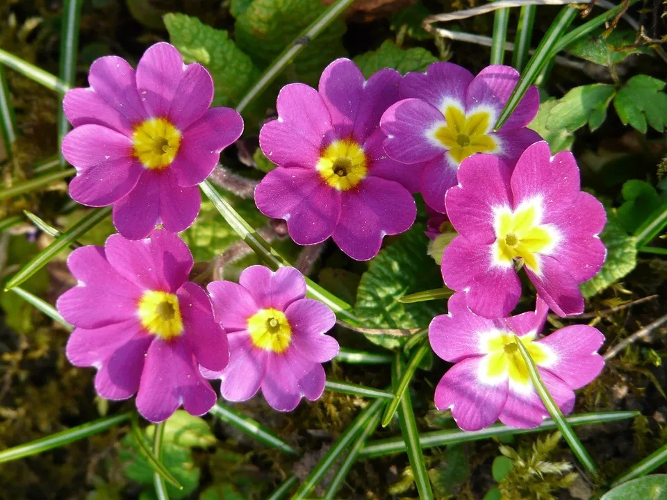 |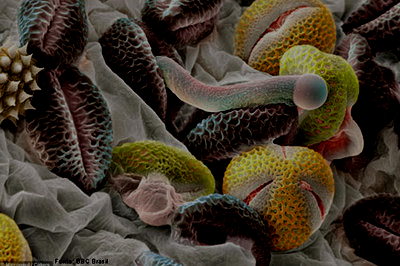 |

### Destacando em Canal de Cores
|  Saída canal Vermelho - Flor                     | Saída canal Verde - Flor                    | Saída canal Blue - Flor                     |
|--------------------------------------------------|---------------------------------------------|---------------------------------------------|
| 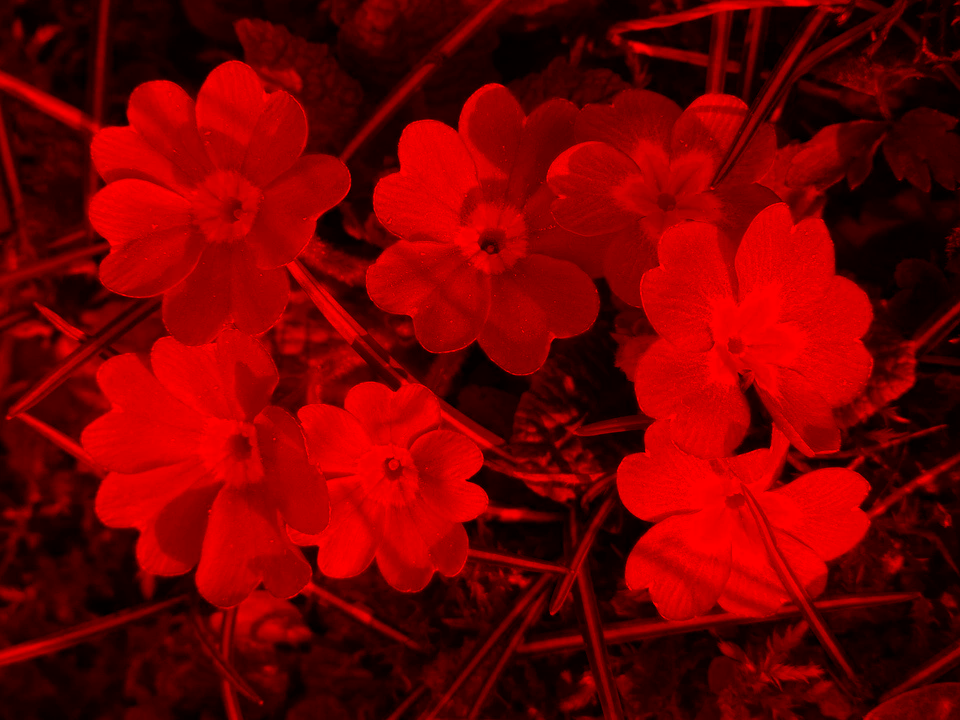 | 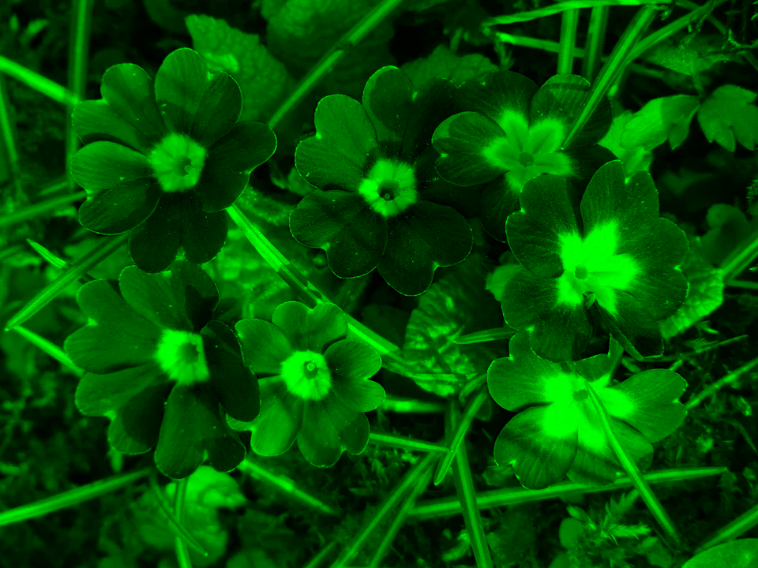 | 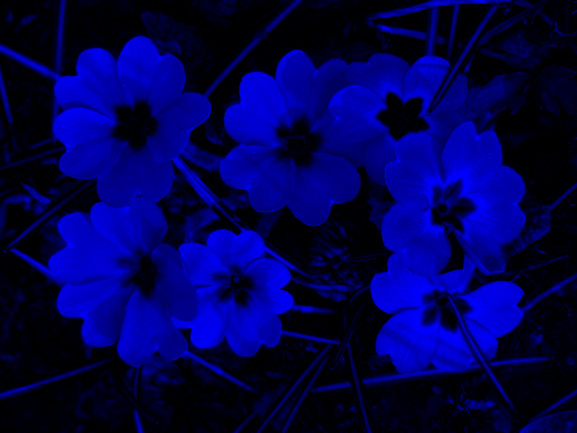 |

### Transformação para tons de cinza
|  Imagem de Entrada - Flor                         | Imagem de Entrada - Polén                    |
|---------------------------------------------------|----------------------------------------------|
|  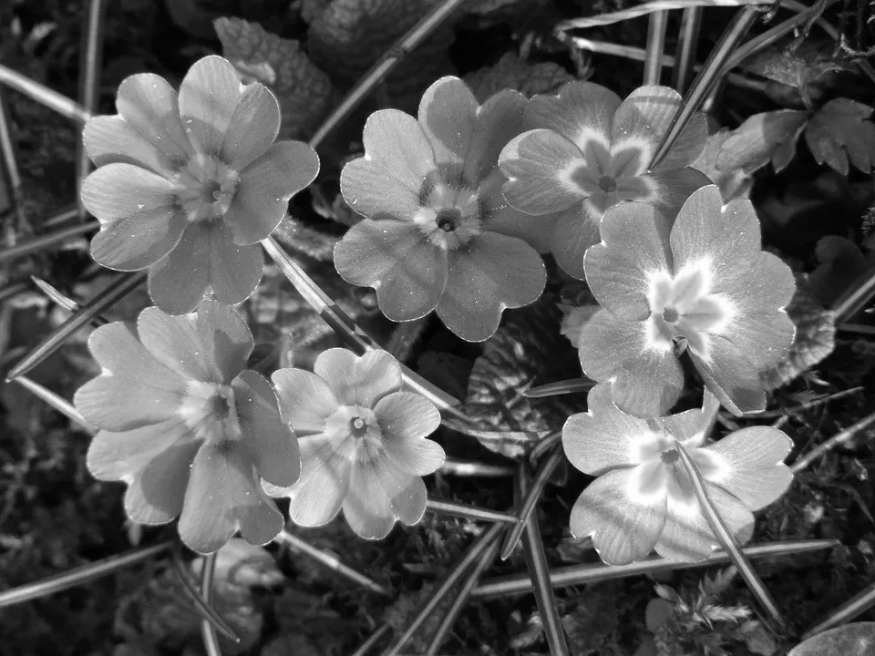 |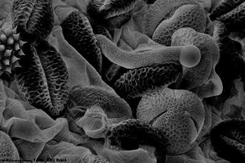 |

### Equalização nos canais de cores

 - Obs: A equalização de canais de cores, acaba por suavizar um canal de cor, o que faz com que outras tonalidades se destaquem segundo o cubo de RGB

|  Equalização no canal Vermelho - Flor                |  Equalização no canal Verde - Flor                   |  Equalização no canal Azul - Flor                    |
|------------------------------------------------------|------------------------------------------------------|------------------------------------------------------|
| 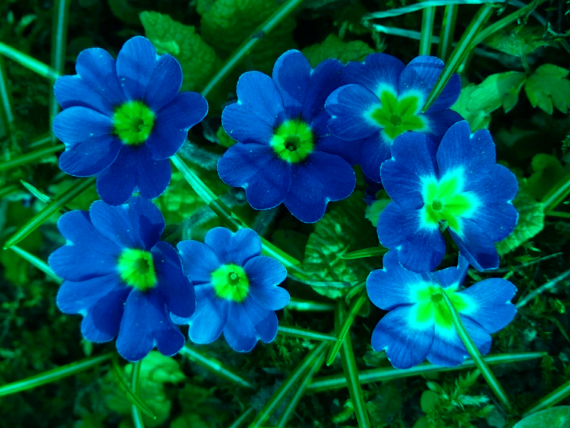 | 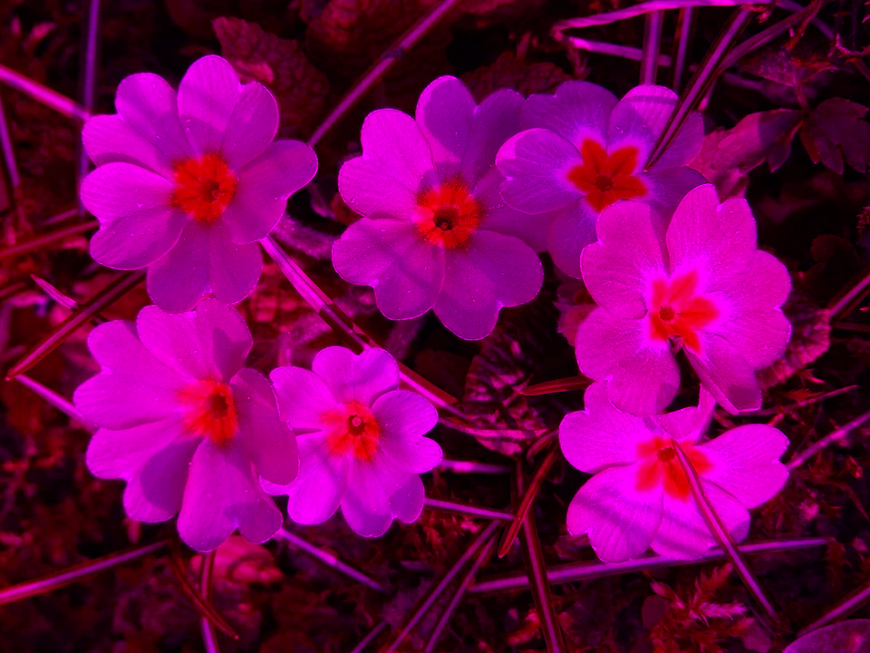 | 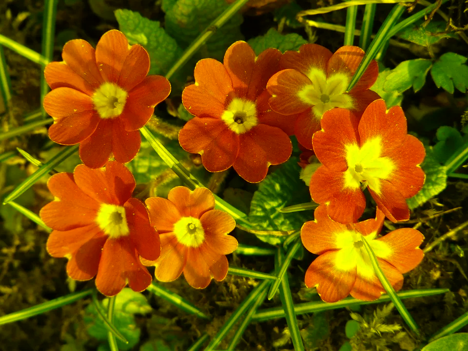 |

### Equalização em imagens em tons de cinza
|  Equalização - Flor                |  Equalização - Polén                   |  Equalização - Xadrez                    |
|------------------------------------|----------------------------------------|------------------------------------------|
| 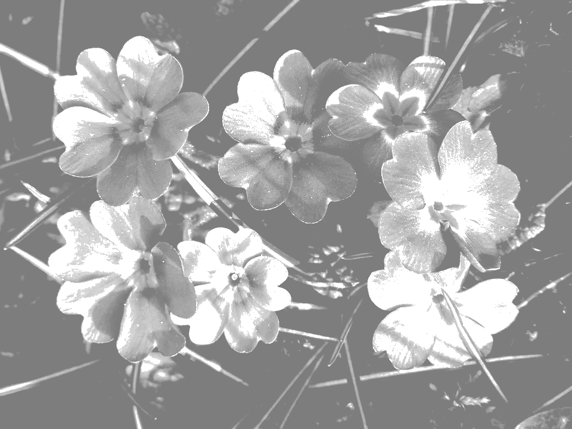 | 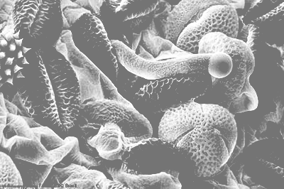 |  |

### Especificação de Histograma nos canais de cores
|  Especificação no canal Vermelho - Flor  |  Especificação no canal Vermelho - Flor  |  Especificação no canal Vermelho - Flor  |
|------------------------------------------|------------------------------------------|------------------------------------------|
| 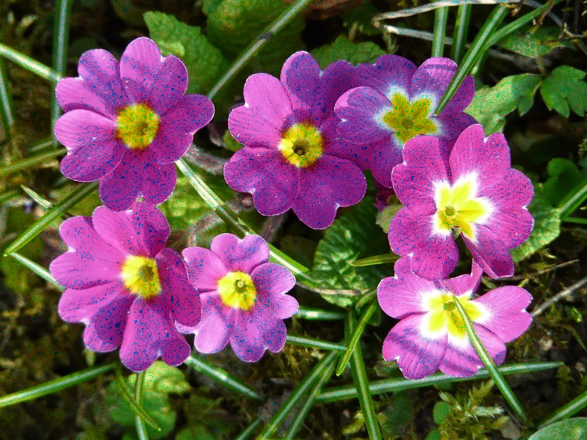 |  |  |

### Especificação de Histograma em tons de cinza
|  Imagem de entrada - Flor  |  Imagem de entrada - Polén    |  Imagem de entrada - Polén    |
|----------------------------|-------------------------------|-------------------------------|
|  | 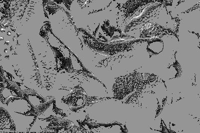 | 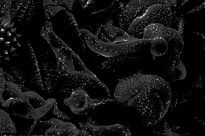 |